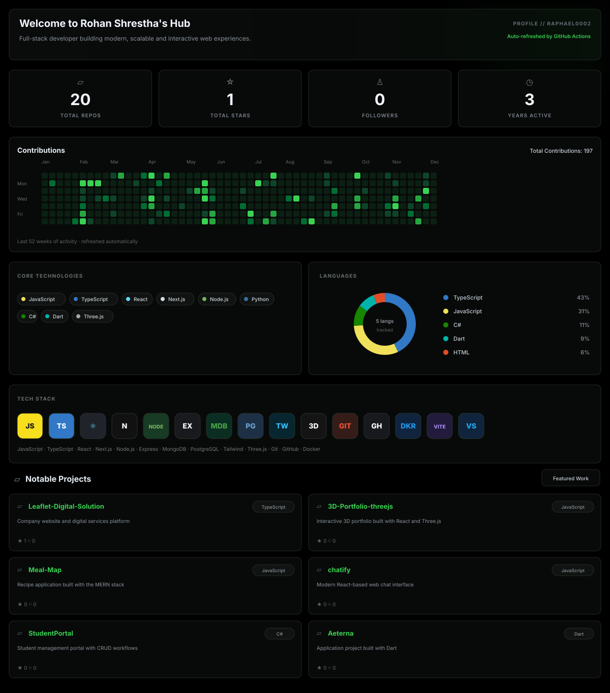

 

<picture>
  <source media="(max-width: 650px)" srcset="./assets/dashboard-mobile.svg">
  
</picture>

  

### `TOOLS I BUILD WITH`

  

### `LIVE DEVELOPMENT ACTIVITY`

 

<picture>
  <source media="(prefers-color-scheme: dark)" srcset="https://raw.githubusercontent.com/raphael0002/raphael0002/output/github-snake-dark.svg">
  <source media="(prefers-color-scheme: light)" srcset="https://raw.githubusercontent.com/raphael0002/raphael0002/output/github-snake.svg">
  
</picture>

  

  

BUILDING · LEARNING · IMPROVING

