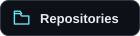
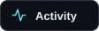

<h1 align="center">Rohan Shrestha</h1>

<strong>Full-stack developer</strong>

  

I build web applications, business websites, and interactive 3D experiences. React and Next.js on the frontend. Node.js and databases behind the scenes.

  
  &nbsp;
  
  &nbsp;
  

 

<!-- PROFILE:START -->

<h3 align="center">A snapshot of my GitHub</h3>

<table>
<tr>
<td width="220" align="center" valign="middle"><h3>20</h3>
<a href="https://github.com/raphael0002?tab=repositories">Repositories</a>
</td>
<td width="220" align="center" valign="middle"><h3>1</h3>
<a href="https://github.com/raphael0002?tab=repositories">Stars earned</a>
</td>
<td width="220" align="center" valign="middle"><h3>2</h3>
<a href="https://github.com/raphael0002?tab=followers">Followers</a>
</td>
<td width="220" align="center" valign="middle"><h3>2</h3>
<a href="https://github.com/raphael0002">Years active</a>
</td>
</tr>
</table>

 

<h3 align="center">My development toolkit</h3>

The tools behind my web applications and interactive experiences.

<table>
<tr>
<td width="293" align="center" valign="top"><h4>Frontend</h4>
 &nbsp;  &nbsp;    &nbsp;  &nbsp; 

JavaScript &middot; TypeScript &middot; React &middot; Next.js &middot; Tailwind CSS &middot; Three.js
</td>
<td width="293" align="center" valign="top"><h4>Backend &amp; data</h4>
 &nbsp;  &nbsp;   

Node.js &middot; Express &middot; MongoDB &middot; PostgreSQL
</td>
<td width="293" align="center" valign="top"><h4>Tools</h4>
 &nbsp;  &nbsp;    &nbsp; 

Git &middot; GitHub &middot; Docker &middot; Vite &middot; VS Code
</td>
</tr>
</table>

 

<h3 align="center">Selected work</h3>

From business websites to real-time interfaces and immersive 3D.

<table>
<tr>
<td width="440" valign="top">
<h4><a href="https://github.com/raphael0002/Leaflet-Digital-Solution">Leaflet Digital Solution</a></h4>

Company website and digital services platform.

<code>TypeScript</code> &nbsp; <a href="https://github.com/raphael0002/Leaflet-Digital-Solution/stargazers">1 star</a> &nbsp; <a href="https://github.com/raphael0002/Leaflet-Digital-Solution/forks">0 forks</a>

</td>
<td width="440" valign="top">
<h4><a href="https://github.com/raphael0002/3D-Portfolio-threejs">3D Portfolio</a></h4>

Interactive 3D portfolio built with React and Three.js.

<code>JavaScript</code> &nbsp; <a href="https://github.com/raphael0002/3D-Portfolio-threejs/stargazers">0 stars</a> &nbsp; <a href="https://github.com/raphael0002/3D-Portfolio-threejs/forks">0 forks</a>

</td>
</tr>
</table>

<table>
<tr>
<td width="440" valign="top">
<h4><a href="https://github.com/raphael0002/Meal-Map">Meal Map</a></h4>

Recipe application built with the MERN stack.

<code>JavaScript</code> &nbsp; <a href="https://github.com/raphael0002/Meal-Map/stargazers">0 stars</a> &nbsp; <a href="https://github.com/raphael0002/Meal-Map/forks">0 forks</a>

</td>
<td width="440" valign="top">
<h4><a href="https://github.com/raphael0002/chatify">Chatify</a></h4>

Modern React-based web chat interface.

<code>JavaScript</code> &nbsp; <a href="https://github.com/raphael0002/chatify/stargazers">0 stars</a> &nbsp; <a href="https://github.com/raphael0002/chatify/forks">0 forks</a>

</td>
</tr>
</table>

<table>
<tr>
<td width="440" valign="top">
<h4><a href="https://github.com/raphael0002/StudentPortal">Student Portal</a></h4>

Student management portal with create, view, update, and delete workflows.

<code>C#</code> &nbsp; <a href="https://github.com/raphael0002/StudentPortal/stargazers">0 stars</a> &nbsp; <a href="https://github.com/raphael0002/StudentPortal/forks">0 forks</a>

</td>
<td width="440" valign="top">
<h4><a href="https://github.com/raphael0002/Aeterna">Aeterna</a></h4>

Application project built with Dart.

<code>Dart</code> &nbsp; <a href="https://github.com/raphael0002/Aeterna/stargazers">0 stars</a> &nbsp; <a href="https://github.com/raphael0002/Aeterna/forks">0 forks</a>

</td>
</tr>
</table>

<a href="https://github.com/raphael0002?tab=repositories">Browse all repositories</a>

 

<h3 align="center">Code &amp; consistency</h3>

<strong>85 contributions</strong> over the past year

81 commits &nbsp; &middot; &nbsp; 0 pull requests &nbsp; &middot; &nbsp; 0 issues &nbsp; &middot; &nbsp; 0 reviews

<picture>
<source media="(prefers-color-scheme: dark)" srcset="./assets/profile/contributions-dark.svg">

</picture>

<a href="https://github.com/raphael0002?tab=overview">Explore contribution history</a>

 

<h3 align="center">Languages in my repositories</h3>

<strong>TypeScript</strong> 52.8% &nbsp; &middot; &nbsp; <strong>JavaScript</strong> 31.6% &nbsp; &middot; &nbsp; <strong>Dart</strong> 11.6% &nbsp; &middot; &nbsp; <strong>CSS</strong> 1.8% &nbsp; &middot; &nbsp; <strong>C++</strong> 0.8% &nbsp; &middot; &nbsp; <strong>Other</strong> 1.4%

Code size across 20 recently updated public repositories, excluding forks.

Profile data refreshed 2026-10-06 UTC &middot; Stars exclude forks.

<!-- PROFILE:END -->
